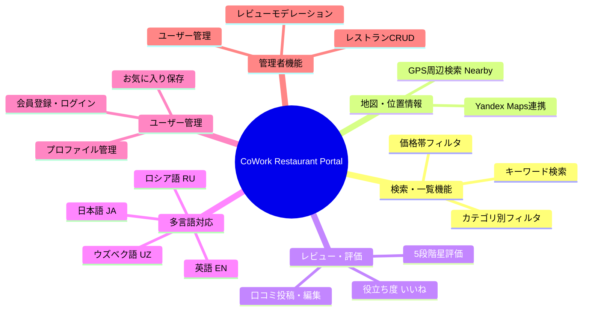

# 企画書 (Project Proposal)

**プロジェクト名**: CoWork Restaurant Portal (コワーク・レストラン・ポータル)  
**サブタイトル**: 多言語対応型 スマート・レストラン検索＆レビューシステム  
**作成者**: Sodiq  
**作成日**: 2026年8月  
**対象機関**: 大学・CoWorkプロジェクト審査委員会  

---

## 1. プロジェクト概要 (Project Overview)
本プロジェクトは、ウズベキスタン（特にタシュケント）を訪れる外国人観光客、ビジネスパーソン、および現地住民向けに開発された**多言語対応（日本語・英語・ロシア語・ウズベク語）スマート・レストラン検索・レビューWebプラットフォーム**です。

インタラクティブな地図連携、料理カテゴリ別フィルター、リアルタイムレビュー・評価、お気に入り保存、および管理者によるモデレーション機能を備え、現代的で高速なNext.js 16 (App Router) + PostgreSQLクラウド環境にて構築されています。

---

## 2. 開発背景と解決する課題 (Background & Problem Statement)

### 📌 現状の課題 (Problem)
1. **言語の壁 (Language Barrier)**: 
   - ウズベキスタン国内のローカルレストラン情報はウズベク語またはロシア語が主流であり、日本人や英語圏の観光客・駐在員が正確な情報（料理、価格帯、営業時間）にアクセスしにくい。
2. **位置情報・地図の不便さ (Map Integration)**: 
   - 既存のまとめサイトでは正確な位置情報や「現在地から一番近いレストラン」の検索が困難。
3. **信頼性のあるレビュー不足 (Lack of Reviews & Ratings)**: 
   - 写真付きのクリーンなUIで、実際の利用者が評価や口コミを投稿できる一元的なプラットフォームが不足している。

### 💡 本システムの解決策 (Solution)
1. **完全4言語対応 (i18n)**:
   - 日本語 (JA)、英語 (EN)、ロシア語 (RU)、ウズベク語 (UZ) に1クリックで即時切替可能。
2. **Yandex Maps / ジオロケーション連携**:
   - GPSによる現在地取得機能（Nearby Restaurants）と、地図上のピン表示による直感的な検索。
3. **高品質なビジュアルと認証付きレビュー**:
   - 高解像度写真ギャラリー、5つ星評価、役立ち度カウント（Helpful votes）、NextAuthによるセキュアなユーザー認証。

---

## 3. システムのターゲット層 (Target Audience)
| ターゲット | ニーズ | 本システムが提供する価値 |
|-----------|--------|--------------------------|
| **外国人観光客・日本人出張者** | 英語・日本語でタシュケントの美味しいレストランを探したい | 母国語でのメニュー・口コミ・地図案内 |
| **現地住民・若年層** | トレンドのカフェやハラール・ファストフードの検索 | リアルタイムレビュー、お気に入り機能、現在地周辺検索 |
| **レストランオーナー・管理者** | 店舗情報の掲載とプロモーション | 管理者ダッシュボードによる店舗登録・編集・レビュー管理 |

---

## 4. 主要機能要件 (Functional Requirements)

---

## 5. 採用技術スタック (Technology Stack)

| 区分 | 技術・ライブラリ | 選定理由 |
|------|------------------|----------|
| **フロントエンド** | Next.js 16 (App Router), React 19, TypeScript, Tailwind CSS | サーバーコンポーネントによる高速レンダリングとモダンUI |
| **国際化 (i18n)** | `next-intl` 4.14 | SSRおよびクライアント両方でのシームレスな4言語ルーティング |
| **バックエンド / API** | Next.js Route Handlers (RESTful API) | サーバーレスアーキテクチャによる高スケーラビリティ |
| **データベース** | PostgreSQL (Neon Serverless Cloud) | クラウドスケーラブルなリレーショナルDB、高信頼性 |
| **ORM** | Prisma 5.22 | 型安全なデータベース操作とマイグレーションの自動化 |
| **認証 (Auth)** | NextAuth v5 (Auth.js) | JWTベースのセキュアなセッション管理とロール制御 |
| **地図 (Map)** | Yandex Maps API | ウズベキスタン国内で最も高精度な地図・ジオデータ |
| **インフラ / デプロイ** | Vercel Serverless Platform | グローバルCDN、常時SSL、自動CI/CDパイプライン |

---

## 6. プロジェクトの期待成果 (Expected Outcomes)
1. **利便性の向上**: 多言語対応により、月間外国人利用者の情報探索時間を大幅に削減。
2. **モダンWeb技術の習得**: Next.js App Router、TypeScript、Prisma、Cloud PostgreSQL を用いたフルスタック開発スキルの実証。
3. **実稼働デモの公開**: 常時稼働するVercelデモURLを通じた即時評価・プレゼンテーションの実現。
