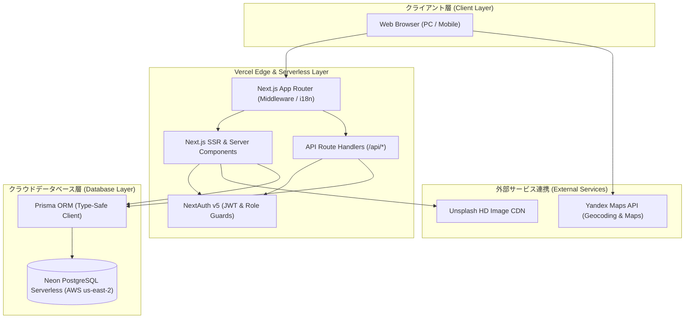
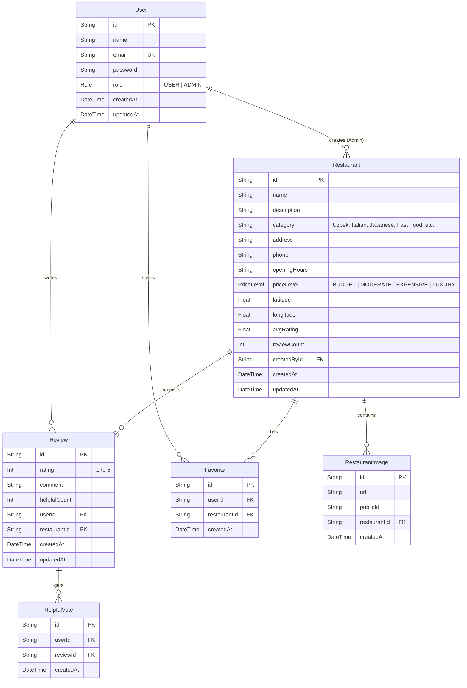

# 設計書 (Design Document)

**プロジェクト名**: CoWork Restaurant Portal  
**文書種別**: システム基本設計書・詳細設計書  
**作成者**: Sodiq  
**バージョン**: 2.0 (PostgreSQL & Vercel Cloud Edition)  

---

## 1. システムアーキテクチャ (System Architecture)

---

## 2. データベース物理設計・ER図 (Database ER Diagram)

---

## 3. 画面設計・UI/UXレイアウト (UI/UX Design)

| 画面名 | パス (URL) | 主な構成要素と機能 |
|--------|------------|-------------------|
| **トップ画面 (Home)** | `/[locale]/` | ヒーローセクション、リアルタイムキーワード検索、人気カテゴリカルーセル、おすすめレストランカード、統計カウンター |
| **レストラン一覧 (Explore)** | `/[locale]/restaurants` | カテゴリフィルター、価格帯フィルター、ソート（評価順・新着順）、グリッドカード、ページネーション |
| **レストラン詳細 (Detail)** | `/[locale]/restaurants/[id]` | 写真ギャラリー、店舗基本情報（営業時間・電話・住所）、Yandex Maps埋め込み、星評価付きレビュー一覧、口コミ投稿フォーム |
| **周辺検索 (Nearby)** | `/[locale]/nearby` | ブラウザGPSによる現在地測位、半径5km/10km以内のレストラン距離順ソート表示 |
| **お気に入り (Favorites)** | `/[locale]/favorites` | ログインユーザーが保存したレストラン一覧、1クリック削除機能 |
| **ユーザー認証 (Auth)** | `/[locale]/login`, `/register` | バリデーション付きサインアップ・サインイン、パスワード暗号化（bcryptjs） |
| **マイページ (Profile)** | `/[locale]/profile` | ユーザー情報表示、投稿したレビュー履歴一覧 |
| **管理者ダッシュボード (Admin)** | `/[locale]/admin` | レストラン追加・編集・削除、全レビューのモデレーション、ユーザー権限管理 |

---

## 4. RESTful API インターフェース設計 (API Specification)

| メソッド | エンドポイント | 説明 | 認証要否 |
|---------|----------------|------|----------|
| `GET` | `/api/restaurants` | レストラン一覧取得（検索・カテゴリ・価格フィルタ） | 不要 |
| `POST` | `/api/restaurants` | 新規レストラン登録 | Admin必須 |
| `GET` | `/api/restaurants/[id]` | レストラン詳細データ取得 | 不要 |
| `PUT` | `/api/restaurants/[id]` | レストラン情報更新 | Admin必須 |
| `DELETE` | `/api/restaurants/[id]` | レストラン削除 | Admin必須 |
| `GET` | `/api/restaurants/nearby` | 緯度・経度パラメータによる近隣店舗検索 | 不要 |
| `POST` | `/api/reviews` | レビュー新規投稿 | ログイン必須 |
| `DELETE` | `/api/reviews/[id]` | レビュー削除 | 本人またはAdmin |
| `POST` | `/api/reviews/[id]/helpful` | レビューへの「役立った」投票トグル | ログイン必須 |
| `GET` | `/api/favorites` | ログイン中ユーザーのお気に入り取得 | ログイン必須 |
| `POST` | `/api/favorites` | お気に入り追加/解除トグル | ログイン必須 |
| `POST` | `/api/auth/register` | 新規ユーザー登録（パスワードハッシュ化） | 不要 |
| `GET` | `/api/admin/users` | 登録ユーザー一覧取得 | Admin必須 |
