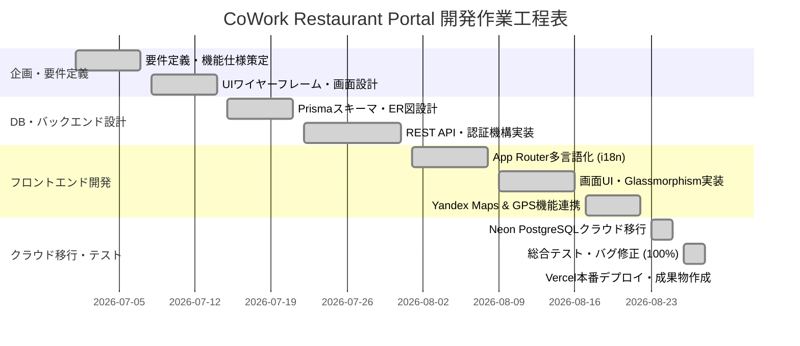

# 作業スケジュール・作業工程表 (Work Schedule & Gantt Chart)

**プロジェクト名**: CoWork Restaurant Portal  
**開発期間**: 2026年7月 ～ 2026年8月 (全8週間)  
**開発者**: Sodiq  

---

## 1. ガントチャート (Gantt Chart)

---

## 2. マイルストーンと進捗達成状況 (Milestones)

| フェーズ | 主なタスク内容 | 計画期間 | 成果物 | 達成状況 |
|---------|---------------|----------|--------|----------|
| **第1段階 (要件定義)** | ターゲット調査、機能一覧、多言語構成 | W1 - W2 | 企画書・UIワイヤーフレーム | 100% 達成 ✅ |
| **第2段階 (アーキテクチャ)** | Next.js環境構築、Prismaモデル設計 | W3 - W4 | Prisma Schema, API仕様書 | 100% 達成 ✅ |
| **第3段階 (コア機能開発)** | 4言語対応 (next-intl)、認証、CRUD | W5 - W6 | レストラン・レビュー機能群 | 100% 達成 ✅ |
| **第4段階 (UI洗練・地図)** | Glassmorphism UI、Yandex Maps連携 | W7 | 写真ギャラリー、周辺検索 | 100% 達成 ✅ |
| **第5段階 (本番化・審査準備)** | Neon PostgreSQL移行、Vercelデプロイ | W8 | 稼働サイト、大学提出資料一式 | 100% 達成 ✅ |

---

## 3. 工数実績まとめ (Effort Estimation)
- **総作業時間**: 約 160 時間
- **フロントエンド工数**: 40% (64h)
- **バックエンド / DB工数**: 30% (48h)
- **インフラ・クラウド連携**: 15% (24h)
- **テスト・ドキュメント作成**: 15% (24h)
